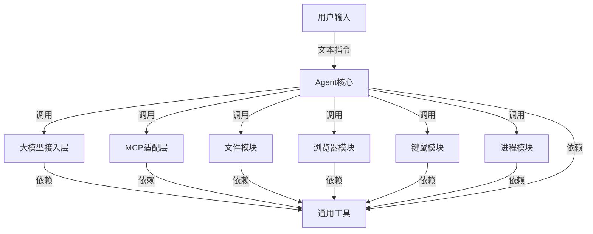

# fastmcp Agent 项目方案设计

## 一、项目目标
基于 fastmcp 框架，实现一个通过文本输入（命令行）来进行文件操作、浏览器操作、键鼠操作、程序控制等功能的智能 Agent。支持自定义大模型接入，兼容本地和云端 MCP 服务，具备高度扩展性和兼容性。

---

## 二、整体架构



- **core（核心层）**：负责指令解析、工具调度、上下文管理。
- **llm（大模型接入层）**：支持多种大模型接入（如OpenAI、Anthropic、本地模型等），提供统一接口。
- **mcp（MCP适配层）**：适配本地和云端MCP服务，提供统一操作接口。
- **tools（工具层）**：每个功能模块（文件、浏览器、键鼠、进程）为独立子包，内部细分 api、service、utils。
- **common（通用层）**：日志、异常、通用辅助函数等。
- **tests（测试层）**：各模块单元测试。
- **输入输出**：初期命令行交互，后续可扩展 Web UI/API。

---

## 三、功能模块划分

### 1. 文件操作模块
- 文件/目录的增删改查
- 文件内容读取、写入、搜索

### 2. 浏览器操作模块
- 打开网页、点击、表单填写、截图等
- 可用 Playwright/Selenium 实现

### 3. 键鼠操作模块
- 鼠标移动、点击、键盘输入、快捷键
- 可用 pyautogui/keyboard/mouse 实现

### 4. 程序控制模块
- 启动、终止、监控本地进程
- 获取进程列表

---

## 四、命令行交互流程

1. 用户在命令行输入自然语言指令
2. Agent 解析指令，确定意图和参数
3. Agent 根据配置选择合适的大模型处理指令
4. 大模型分析指令，确定需要调用的工具和所需的能力（capability）
5. MCP路由器根据路由策略选择合适的MCP服务：
   - 如果使用能力匹配策略，选择具备所需能力且优先级最高的MCP
   - 如果使用优先级优先策略，选择优先级最高的可用MCP
   - 如果使用负载均衡策略，在可用MCP中随机选择
6. Agent 通过选定的MCP执行相应操作
7. 如果执行失败，尝试使用备选MCP重试操作
8. 操作结果返回给大模型进行解析和总结
9. Agent 将结果输出到命令行

### 配置文件示例

```yaml
# config.yaml

# 大模型配置
llm:
  default: "openai"  # 默认使用的大模型
  models:
    openai:
      api_key: "${OPENAI_API_KEY}"  # 支持环境变量
      model: "gpt-4o"
      temperature: 0.7
    anthropic:
      api_key: "${ANTHROPIC_API_KEY}"
      model: "claude-3-opus"
    local:
      model_path: "./models/llama3-8b"
      device: "cuda"

# MCP配置
mcp:
  services:
    # 可以配置多个MCP服务，支持同时使用多个MCP
    local:
      type: "local"
      enabled: true  # 是否启用
      priority: 1    # 优先级，数字越小优先级越高
      capabilities: ["file", "browser", "mouse", "process"]  # 该MCP支持的能力
    cloud_primary:
      type: "cloud"
      enabled: true
      priority: 2
      capabilities: ["file", "browser"]
      endpoint: "https://api.example1.com/mcp"
      api_key: "${CLOUD_MCP1_API_KEY}"
    cloud_secondary:
      type: "cloud"
      enabled: true
      priority: 3
      capabilities: ["mouse", "process"]
      endpoint: "https://api.example2.com/mcp"
      api_key: "${CLOUD_MCP2_API_KEY}"
  # 路由策略：capability_match(按能力匹配), priority_first(优先级优先), load_balance(负载均衡)
  routing_strategy: "capability_match"

# 工具配置
tools:
  enabled:
    - file
    - browser
    - mouse
    - process
  browser:
    engine: "playwright"  # 或 "selenium"
  mouse:
    library: "pyautogui"  # 或 "mouse"

# 日志配置
logging:
  level: "INFO"
  file: "./logs/agent.log"
```

---

## 五、推荐项目结构

```
LX_Agent/
  |-- main.py                # 项目主入口，命令行交互
  |-- config.py              # 全局配置
  |-- core/                  # Agent核心，指令解析、调度、上下文管理
      |-- __init__.py
      |-- agent.py
      |-- parser.py
      |-- dispatcher.py
      |-- context.py
      |-- session.py         # 会话管理
  |-- llm/                   # 大模型接入层
      |-- __init__.py
      |-- base.py            # 基础抽象类
      |-- openai.py          # OpenAI模型适配
      |-- anthropic.py       # Anthropic模型适配
      |-- local.py           # 本地模型适配
      |-- factory.py         # 模型工厂类
  |-- mcp/                   # MCP适配层
      |-- __init__.py
      |-- base.py            # 基础抽象类
      |-- local_mcp.py       # 本地MCP适配
      |-- cloud_mcp.py       # 云端MCP适配
      |-- router.py          # MCP路由器
      |-- factory.py         # MCP工厂类
  |-- tools/                 # 工具层，各功能模块
      |-- __init__.py
      |-- base.py            # 工具基类
      |-- registry.py        # 工具注册中心
      |-- file/
          |-- __init__.py
          |-- api.py
          |-- service.py
          |-- utils.py
      |-- browser/
          |-- __init__.py
          |-- api.py
          |-- service.py
          |-- utils.py
      |-- mouse/
          |-- __init__.py
          |-- api.py
          |-- service.py
          |-- utils.py
      |-- process/
          |-- __init__.py
          |-- api.py
          |-- service.py
          |-- utils.py
  |-- common/                # 通用工具、基础设施
      |-- __init__.py
      |-- logger.py
      |-- exceptions.py
      |-- helpers.py
      |-- config_loader.py   # 配置加载器
      |-- plugin_manager.py  # 插件管理器
  |-- api/                   # API接口层
      |-- __init__.py
      |-- rest.py            # REST API
      |-- websocket.py       # WebSocket API
  |-- tests/                 # 单元测试
      |-- test_file_tools.py
      |-- test_browser_tools.py
      |-- test_llm.py
      |-- test_mcp.py
      |-- ...
  |-- requirements.txt
  |-- README.md
  |-- docs/
      |-- 方案设计.md
      |-- api文档.md
      |-- 扩展开发指南.md
```

---

## 六、各层职责说明

### 1）core（核心层）
- 负责指令解析、上下文管理、工具调度、会话管理等。
- 例如：`agent.py` 负责主流程，`parser.py` 负责自然语言指令解析，`dispatcher.py` 负责调用不同的 tool。
- `session.py` 管理用户会话状态，支持多轮对话和上下文保持。

### 2）llm（大模型接入层）
- 提供统一的大模型接口抽象，支持多种大模型的接入。
- 基于工厂模式和策略模式，实现大模型的可插拔设计。
- 支持OpenAI、Anthropic、本地模型等多种大模型，可通过配置文件灵活切换。
- 提供模型能力的统一封装，如文本生成、向量嵌入、函数调用等。

### 3）mcp（MCP适配层）
- 提供统一的MCP服务接口抽象，支持多个本地和云端MCP服务的同时接入。
- 基于适配器模式，屏蔽不同MCP实现的差异。
- 实现MCP服务的自动发现、连接、断线重连等功能。
- 提供MCP路由器，根据配置的路由策略将操作请求路由到合适的MCP服务。
- 支持按能力匹配、优先级优先、负载均衡等多种路由策略。
- 实现MCP服务的健康检查和故障转移机制。

### 4）tools（工具层）
- 每个功能模块（如 file、browser、mouse、process）为一个子包，内部再细分 api、service、utils。
- **base.py**：定义工具基类和接口规范，所有工具需继承此基类。
- **registry.py**：工具注册中心，实现工具的动态注册和发现。
- **api.py**：对外暴露接口，参数校验、异常处理，调用 service。
- **service.py**：实现具体业务逻辑，组合调用 utils。
- **utils.py**：底层通用工具函数。

### 5）common（通用层）
- 放置日志、异常、通用辅助函数等，供全局调用。
- **config_loader.py**：负责加载和解析配置文件，支持多环境配置。
- **plugin_manager.py**：插件管理器，支持动态加载和卸载插件。

### 6）api（API接口层）
- 提供REST和WebSocket API，支持外部系统集成。
- 实现API鉴权、限流、监控等功能。

### 7）tests（测试层）
- 各模块的单元测试，保证代码质量。
- 支持自动化测试和集成测试。

---

## 七、设计亮点

- **高内聚低耦合**：结构清晰，各模块职责明确，便于维护和扩展。
- **多模型支持**：基于抽象接口和工厂模式，支持多种大模型的无缝切换和扩展。
- **多MCP支持**：支持同时接入多个本地和云端MCP服务，通过智能路由策略（能力匹配、优先级、负载均衡）将操作请求分发到最合适的MCP，提供故障转移机制，确保系统高可用性。
- **插件化架构**：基于插件机制，支持动态加载和卸载功能模块，实现功能的热插拔。
- **统一API**：提供REST和WebSocket API，便于与外部系统集成。
- **可配置性**：通过配置文件灵活调整系统行为，无需修改代码。
- **易于协作和测试**：完善的测试框架和文档，便于团队协作和质量保障。

---

## 八、扩展性和兼容性设计

### 1. 大模型扩展

基于抽象接口和工厂模式，实现大模型的可插拔设计：

```python
# 大模型抽象接口
class BaseLLM(ABC):
    @abstractmethod
    def generate(self, prompt, **kwargs):
        pass
        
    @abstractmethod
    def get_embeddings(self, text, **kwargs):
        pass

# 具体实现类
class OpenAILLM(BaseLLM):
    def generate(self, prompt, **kwargs):
        # OpenAI实现
        pass
        
class AnthropicLLM(BaseLLM):
    def generate(self, prompt, **kwargs):
        # Anthropic实现
        pass

# 工厂类
class LLMFactory:
    @staticmethod
    def create(llm_type, **kwargs):
        if llm_type == "openai":
            return OpenAILLM(**kwargs)
        elif llm_type == "anthropic":
            return AnthropicLLM(**kwargs)
        # 更多模型支持...
```

### 2. MCP适配层设计

使用适配器模式和路由器模式，统一管理多个MCP服务：

```python
# MCP抽象接口
class BaseMCP(ABC):
    @abstractmethod
    def connect(self):
        pass
        
    @abstractmethod
    def disconnect(self):
        pass
        
    @abstractmethod
    def execute_command(self, command, **kwargs):
        pass
        
    @abstractmethod
    def get_capabilities(self):
        """返回该MCP支持的能力列表"""
        pass
        
    @abstractmethod
    def is_available(self):
        """检查MCP是否可用"""
        pass

# 本地MCP适配器
class LocalMCPAdapter(BaseMCP):
    def __init__(self, config):
        self.config = config
        self.capabilities = config.get("capabilities", [])
        self.connected = False
        
    def connect(self):
        # 连接本地MCP
        self.connected = True
        return True
        
    def disconnect(self):
        # 断开连接
        self.connected = False
        
    def execute_command(self, command, **kwargs):
        # 执行本地命令
        if not self.connected:
            raise ConnectionError("Not connected to local MCP")
        # 执行命令的逻辑
        return {"status": "success", "result": "command executed"}
        
    def get_capabilities(self):
        return self.capabilities
        
    def is_available(self):
        return self.connected

# 云端MCP适配器
class CloudMCPAdapter(BaseMCP):
    def __init__(self, config):
        self.endpoint = config.get("endpoint")
        self.api_key = config.get("api_key")
        self.capabilities = config.get("capabilities", [])
        self.session = None
        
    def connect(self):
        try:
            # 连接云端MCP
            self.session = requests.Session()
            self.session.headers.update({
                "Authorization": f"Bearer {self.api_key}",
                "Content-Type": "application/json"
            })
            response = self.session.post(f"{self.endpoint}/connect")
            return response.status_code == 200
        except Exception as e:
            print(f"Failed to connect to cloud MCP: {e}")
            return False
            
    def disconnect(self):
        if self.session:
            try:
                self.session.post(f"{self.endpoint}/disconnect")
            except:
                pass
            finally:
                self.session = None
                
    def execute_command(self, command, **kwargs):
        if not self.session:
            raise ConnectionError("Not connected to cloud MCP")
            
        payload = {
            "command": command,
            **kwargs
        }
        response = self.session.post(f"{self.endpoint}/execute", json=payload)
        return response.json()
        
    def get_capabilities(self):
        return self.capabilities
        
    def is_available(self):
        return self.session is not None

# MCP工厂类
class MCPFactory:
    @classmethod
    def create(cls, name, config):
        mcp_type = config.get("type")
        if mcp_type == "local":
            return LocalMCPAdapter(config)
        elif mcp_type == "cloud":
            return CloudMCPAdapter(config)
        else:
            raise ValueError(f"Unsupported MCP type: {mcp_type}")

# MCP路由器
class MCPRouter:
    def __init__(self, config):
        self.mcps = {}
        self.routing_strategy = config.get("routing_strategy", "capability_match")
        
        # 初始化所有配置的MCP服务
        for name, mcp_config in config.get("services", {}).items():
            if mcp_config.get("enabled", True):
                try:
                    mcp = MCPFactory.create(name, mcp_config)
                    if mcp.connect():
                        self.mcps[name] = {
                            "instance": mcp,
                            "config": mcp_config,
                            "priority": mcp_config.get("priority", 999)
                        }
                        print(f"Successfully connected to MCP: {name}")
                    else:
                        print(f"Failed to connect to MCP: {name}")
                except Exception as e:
                    print(f"Error initializing MCP {name}: {e}")
    
    def route_command(self, command, capability=None, **kwargs):
        """根据路由策略选择合适的MCP执行命令"""
        available_mcps = {name: mcp for name, mcp in self.mcps.items() 
                         if mcp["instance"].is_available()}
        
        if not available_mcps:
            raise RuntimeError("No available MCP services")
            
        if self.routing_strategy == "capability_match" and capability:
            # 按能力匹配策略
            capable_mcps = {name: mcp for name, mcp in available_mcps.items() 
                           if capability in mcp["instance"].get_capabilities()}
            
            if not capable_mcps:
                raise ValueError(f"No MCP available with capability: {capability}")
                
            # 按优先级排序有能力的MCP
            sorted_mcps = sorted(capable_mcps.items(), key=lambda x: x[1]["priority"])
            selected_mcp = sorted_mcps[0][1]["instance"]
            
        elif self.routing_strategy == "priority_first":
            # 优先级优先策略
            sorted_mcps = sorted(available_mcps.items(), key=lambda x: x[1]["priority"])
            selected_mcp = sorted_mcps[0][1]["instance"]
            
        elif self.routing_strategy == "load_balance":
            # 简单的负载均衡策略（随机选择）
            import random
            selected_name = random.choice(list(available_mcps.keys()))
            selected_mcp = available_mcps[selected_name]["instance"]
            
        else:
            # 默认使用第一个可用的MCP
            selected_mcp = next(iter(available_mcps.values()))["instance"]
            
        # 执行命令
        return selected_mcp.execute_command(command, **kwargs)
        
    def close_all(self):
        """关闭所有MCP连接"""
        for name, mcp in self.mcps.items():
            try:
                mcp["instance"].disconnect()
                print(f"Disconnected from MCP: {name}")
            except Exception as e:
                print(f"Error disconnecting from MCP {name}: {e}")
```

### 3. 插件机制

通过插件机制实现功能的动态扩展：

```python
# 插件基类
class BasePlugin(ABC):
    @abstractmethod
    def initialize(self):
        pass
        
    @abstractmethod
    def get_tools(self):
        pass

# 插件管理器
class PluginManager:
    def __init__(self):
        self.plugins = {}
        
    def register_plugin(self, name, plugin):
        self.plugins[name] = plugin
        plugin.initialize()
        
    def get_all_tools(self):
        tools = {}
        for plugin in self.plugins.values():
            tools.update(plugin.get_tools())
        return tools
```

---

如需具体某模块实现细节或代码示例，可随时提出！