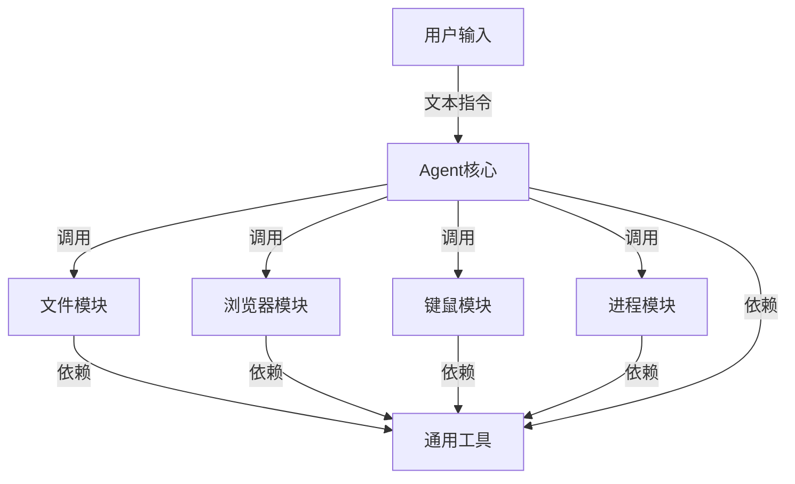

# fastmcp Agent 项目方案设计

## 一、项目目标
基于 fastmcp 框架，实现一个通过文本输入（命令行）来进行文件操作、浏览器操作、键鼠操作、程序控制等功能的智能 Agent。

---

## 二、整体架构



- **core（核心层）**：负责指令解析、工具调度、上下文管理。
- **tools（工具层）**：每个功能模块（文件、浏览器、键鼠、进程）为独立子包，内部细分 api、service、utils。
- **common（通用层）**：日志、异常、通用辅助函数等。
- **tests（测试层）**：各模块单元测试。
- **输入输出**：初期命令行交互，后续可扩展 Web UI/API。

---

## 三、功能模块划分

### 1. 文件操作模块
- 文件/目录的增删改查
- 文件内容读取、写入、搜索

### 2. 浏览器操作模块
- 打开网页、点击、表单填写、截图等
- 可用 Playwright/Selenium 实现

### 3. 键鼠操作模块
- 鼠标移动、点击、键盘输入、快捷键
- 可用 pyautogui/keyboard/mouse 实现

### 4. 程序控制模块
- 启动、终止、监控本地进程
- 获取进程列表

---

## 四、命令行交互流程

1. 用户在命令行输入自然语言指令
2. Agent 解析指令，调用对应 tool
3. tool 执行操作，返回结果
4. Agent 输出结果到命令行

---

## 五、推荐项目结构

```
LX_Agent/
  |-- main.py                # 项目主入口，命令行交互
  |-- config.py              # 全局配置
  |-- core/                  # Agent核心，指令解析、调度、上下文管理
      |-- __init__.py
      |-- agent.py
      |-- parser.py
      |-- dispatcher.py
      |-- context.py
  |-- tools/                 # 工具层，各功能模块
      |-- file/
          |-- __init__.py
          |-- api.py
          |-- service.py
          |-- utils.py
      |-- browser/
          |-- __init__.py
          |-- api.py
          |-- service.py
          |-- utils.py
      |-- mouse/
          |-- __init__.py
          |-- api.py
          |-- service.py
          |-- utils.py
      |-- process/
          |-- __init__.py
          |-- api.py
          |-- service.py
          |-- utils.py
  |-- common/                # 通用工具、基础设施
      |-- __init__.py
      |-- logger.py
      |-- exceptions.py
      |-- helpers.py
  |-- tests/                 # 单元测试
      |-- test_file_tools.py
      |-- test_browser_tools.py
      |-- ...
  |-- requirements.txt
  |-- README.md
  |-- docs/
      |-- 方案设计.md
```

---

## 六、各层职责说明

### 1）core（核心层）
- 负责指令解析、上下文管理、工具调度、会话管理等。
- 例如：`agent.py` 负责主流程，`parser.py` 负责自然语言指令解析，`dispatcher.py` 负责调用不同的 tool。

### 2）tools（工具层）
- 每个功能模块（如 file、browser、mouse、process）为一个子包，内部再细分 api、service、utils。
- **api.py**：对外暴露接口，参数校验、异常处理，调用 service。
- **service.py**：实现具体业务逻辑，组合调用 utils。
- **utils.py**：底层通用工具函数。

### 3）common（通用层）
- 放置日志、异常、通用辅助函数等，供全局调用。

### 4）tests（测试层）
- 各模块的单元测试，保证代码质量。

---

## 七、设计亮点

- 高内聚低耦合，结构清晰，便于维护和扩展。
- 易于协作和测试。
- 可扩展性强，后续增加新功能只需在 tools 下加新模块即可。

---

如需具体某模块实现细节或代码示例，可随时提出！ 